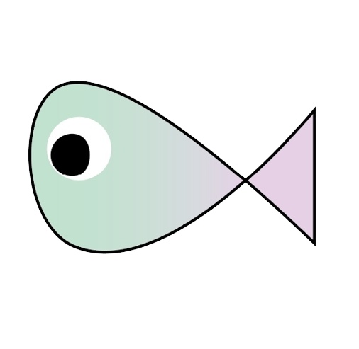

#  Fish-25     

---

`Fish-25`는 관상어의 정보를 공유하는 커뮤니티입니다.

 

## Projects

---

이 프로젝트의 모든 작업은 [🔰 이슈](https://github.com/telos-projects/fish-25/issues)로 취급되며, 이러한 이슈들은 [📖 프로젝트 칸반](https://github.com/telos-projects/fish-25/projects/1)에서 관리됩니다.

 

## Code of Conduct

---

이 프로젝트는 `telos-projects`의 [📜 행동 강령](docs/CODE_OF_CONDUCT.adoc)을 적용 받습니다. 이 프로젝트에 참여함으로써 귀하는 이 행동 강령을 반드시 준수해야 합니다. 용납할 수 없는 행동을 하는 자를 발견하였다면 `projects.telos@gmail.com`로 연락하세요.

 

## Documentation

---

이 프로젝트에 대한 모든 문서는 [📜 위키](https://github.com/telos-projects/fish-25/wiki)에서 관리됩니다. 위키를 반드시 참고하세요.

 

## License

---

`telos-projects`의 코드들은 기본적으로 [📜 MIT LICENSE](https://opensource.org/licenses/MIT)로 공개되어 있지만, 간혹 불가피하게 다른 라이센스를 사용하는 경우도 있을 수 있습니다. 정확한 정보는 각 저장소에 포함 된 `LICENSE` 파일을 참고해주세요.

 
